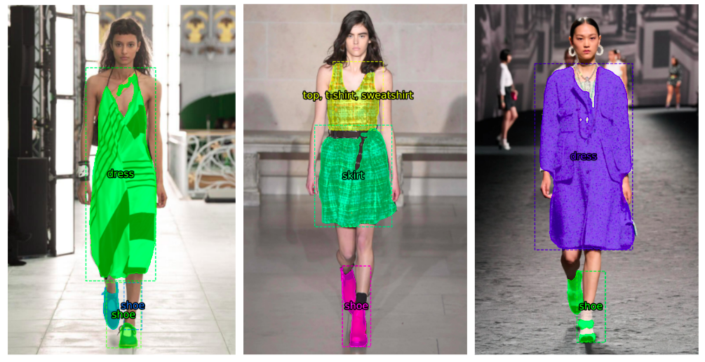

# Project Clothes Segmentation

## Summary
This project involved using Deep Convolutional Neural network to create a machine learning application that could classify clothes based on images. The trained model is going to be deployed in an interactive website to allow users to identify their own pictures.

## Technologies used: 
```
* Python
* Pytorch
* Tensorflow
* Matprotlib
* Streamlit
```

## Results
 

## Installation

1. Clone project`s [repo](https://github.com/sofiia-chorna/clothes-segmentation):

    ```
    git clone https://github.com/sofiia-chorna/clothes-segmentation.git
    ```

2. Install the required packages.
3. To run the application from the command line (terminal) in the project folder, run:

    ```
    streamlit run  app.py
    ```

4. View the application in your default browser by navigating to the following URL:
    ``` 
   http://localhost:8501
   ```

## Future direcitons
I have several ideas to improve this project:
* Add explanations for how the CNN works depending on user selection of dropbox
* If predicted confidence is under some threshold, say something about not being sure about the prediction
* Potentially have a stacked model where the first model predicts if the image is a clothes or not - if not, do something funny to the user for trying to trick me
